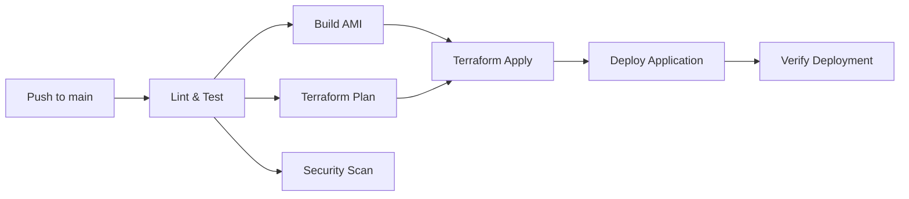

# GitHub Actions CI/CD Guide

## Overview

The CI/CD pipeline automatically builds, tests, and deploys the Student Management System to AWS.

## Pipeline Stages



## Workflow Triggers

- **Push to `main`** - Full pipeline (test, build AMI, deploy)
- **Push to `develop`** - Lint, test, and build check
- **Pull Request to `main`** - Test and Terraform plan only
- **Manual trigger** - Via `workflow_dispatch` with environment selection

## Secrets Configuration

Configure these secrets in your GitHub repository:

### Required Secrets
| Secret | Description |
|--------|-------------|
| `AWS_ACCESS_KEY_ID` | AWS IAM access key |
| `AWS_SECRET_ACCESS_KEY` | AWS IAM secret key |
| `DB_PASSWORD` | RDS master password |
| `JWT_SECRET` | JWT signing secret |

### Optional Variables
| Variable | Description |
|----------|-------------|
| `DOMAIN_NAME` | Custom domain name for Route53 |

## Pipeline Details

### 1. Lint & Test
- Installs dependencies for both frontend and backend
- Runs ESLint
- Builds the frontend
- Verifies backend dependencies

### 2. Build AMI (main only)
- Configures AWS credentials
- Runs Packer to build a custom AMI
- Stores the AMI ID for use in Terraform

### 3. Terraform Plan (PR only)
- Initializes Terraform
- Checks formatting
- Creates a plan for review

### 4. Terraform Apply (main only)
- Applies infrastructure changes
- Uses the new AMI
- Outputs ALB DNS name

### 5. Deploy
- Triggers instance refresh in Auto Scaling Group
- Verifies the health endpoint responds correctly

### 6. Security Scan
- Runs Trivy vulnerability scanner
- Uploads results to GitHub Security tab

## Manual Deployment

```bash
# Trigger workflow manually via GitHub UI
# Or use gh CLI:
gh workflow run deploy.yml --ref main -f environment=staging
```

## Monitoring Pipeline

View pipeline status at: `https://github.com/<owner>/<repo>/actions`

## Troubleshooting

### Pipeline Failure
1. Check the failed step's logs
2. Common issues:
   - AWS credentials expired
   - Terraform state locked
   - Packer build timeout
3. Re-run failed jobs from the GitHub Actions UI

### AMI Build Failure
1. Check Packer logs for command errors
2. Verify the source AMI exists
3. Ensure AWS credentials have EC2 permissions

### Terraform Plan Failure
1. Check for syntax errors
2. Verify variable values
3. Ensure state file is accessible
